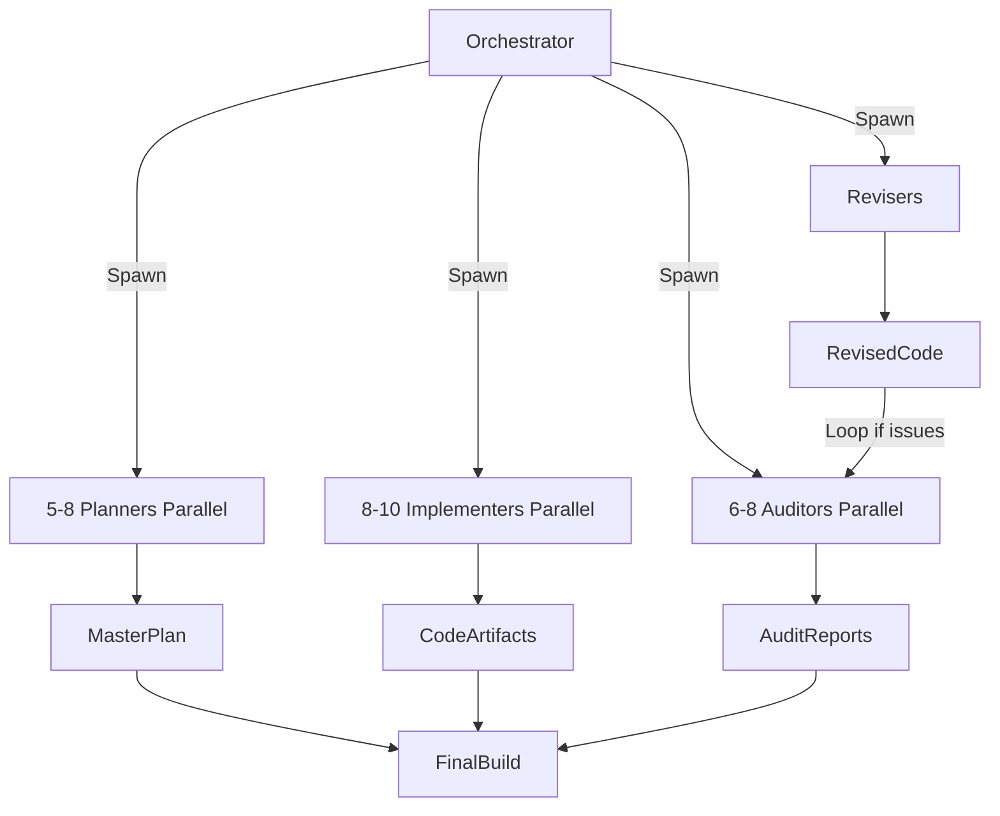

# Agent Swarm Architecture for Grok Build Tauri Control Panel Build

## Overview
This build employs a **Grok-Powered Multi-Agent Swarm** inspired by xAI's sovereign agent systems (Prism, Pillar, Pentarchy). It maximizes parallel execution: up to 20+ specialized agents running simultaneously across planning, implementation, auditing, and revision waves. Orchestration ensures iterative loops fix all errors until the entire control panel is complete, bug-free, and production-ready.

**Key Grok Capacities Leveraged:**
- **Parallel Reasoning:** Multiple independent agent contexts (simulated via detailed specs here; in practice, spawn via multiple Grok API calls or local multi-model routing).
- **Deep Tool Use:** Agents use bash for code gen/compilation checks, web_search for latest Tauri/Rust crates (e.g., tokio 1.40+, tauri 2.x), pdf tools if needed.
- **Self-Referential:** Agents can use Grok Build (via ACP) to help build the control panel itself!
- **Iterative Perfection:** Loops continue until zero errors (auditors report clean).
- **Multi-Perspective:** Every output reviewed from 5+ angles.

## Agent Types (Specialized for Maximum Capacity Utilization)
1. **Planner Agents (5-8 parallel):**
   - Core Architect Planner
   - Concurrency & Async Planner (tokio expert)
   - ACP & JSON-RPC Specialist
   - Tauri 2 Integration Planner
   - Security & Sandboxing Planner
   - Performance & Scalability Planner
   - Error Handling & Resilience Planner
   - Documentation & Advisory Planner

2. **Implementer Agents (8-10 parallel):**
   - One per major crate/module: grok_control_core, grok_acp, grok_cli_wrapper, grok_config, grok_events, tauri_app (main), plus sub for specific features (worktree, memory, scheduler).
   - Deep code writers producing full sketches (structs, traits, impls, examples, tests).

3. **Auditor Agents (6-8 parallel):**
   - Security Auditor (vuln scan, permission model, sandbox)
   - Performance Auditor (async bottlenecks, memory, concurrency races)
   - Correctness & Logic Auditor (code reviews, edge cases)
   - Maintainability & Idiomatic Rust Auditor (clippy-level, docs)
   - Integration Auditor (ACP fidelity, CLI wrapping, config TOML)
   - Concurrency & Error Handling Auditor
   - Completeness Auditor (vs research report features)

4. **Reviser Agents (4-6 parallel or targeted):**
   - Bug Fixer Revisers (one per auditor report category)
   - Optimizer Revisers
   - Refactorer for maintainability
   - Integration Fixer

5. **Orchestrator Agent (1 central, spawns/coordinates all):**
   - Manages waves, collects artifacts (code, reports), decides loop continuation.
   - Criteria for "Done": All auditors give "PASS", code compiles (simulated), features match report 100%, no TODOs left.

## Multi-Wave Orchestration per Phase
**Wave 1: Planning Wave (Parallel Planners)**
- All Planner Agents spawn simultaneously.
- Outputs: Detailed task lists, architecture diagrams (Mermaid in MD), risk matrices, API specs, data models.
- Orchestrator merges into master plan.

**Wave 2: Implementation Wave (Parallel Implementers)**
- Implementers work on assigned modules in parallel.
- Produce: Deep code sketches in /code_sketches/ (full compilable-ish Rust).
- Include unit tests, examples, Cargo.toml snippets.

**Wave 3: Audit Wave (Parallel Auditors)**
- Every code artifact audited by all relevant Auditors in parallel.
- Outputs: Detailed reports with line-specific issues, severity (Critical/High/Med/Low), suggested fixes.
- Use tools: "Run clippy mentally", "Simulate tokio runtime", "Check for Send/Sync issues", etc.

**Wave 4: Revise Wave (Revisers)**
- Targeted Revisers fix based on aggregated auditor reports.
- Produce revised code versions.
- **Loop:** If any Critical/High issues remain, repeat Waves 3-4 until clean (target: 0 critical after 1-2 loops).

**Overall Multi-Phase Waves:**
- Phases run sequentially, but within each phase, full 4-wave cycle.
- Global loop: After all phases, final global audit/revise wave.
- Total agents active: 20+ simultaneously in peak waves.

## Communication & State
- **Shared Memory:** Central repo of artifacts (MD reports, code files, audit logs). Agents read/write via "file system" (simulated).
- **Event Bus (like in the app itself):** Orchestrator broadcasts "Wave Complete", "New Issue Found".
- **ACP Integration:** In advanced waves, agents use `grok agent stdio` (ACP) to query Grok Build for help coding Rust!
- **Persistence:** SQLite-like for session state of build (which modules done, issues open).

## Capacity Maximization
- **Parallelism:** Planners don't wait; Implementers start on partial plans; Auditors review incrementally.
- **Specialization:** Each agent has narrow expertise for depth (Grok excels here).
- **Scalability:** In real xAI deployment, scale to 50+ agents via distributed inference.
- **Error Elimination:** Strict loop until "All Clear" from auditors. No human intervention needed for core loop.
- **Self-Improvement:** Revisers can propose better architectures mid-build.

## Example Agent Prompt Template (for real deployment)
```
You are [Agent Type] for building Grok Build Tauri Control Panel.
Current Phase: [X]
Wave: [Planning/Impl/Audit/Revise]
Previous outputs: [links to files]
Task: [specific]
Output format: Structured MD with sections, code blocks, Mermaid if diagram.
Use tools if needed (search crates.io for versions).
End with confidence and issues found.
```

## Diagrams (Textual - Generate Visual if Needed)


This architecture ensures **maximum utilization of Grok's capacities** for a flawless, comprehensive build.

